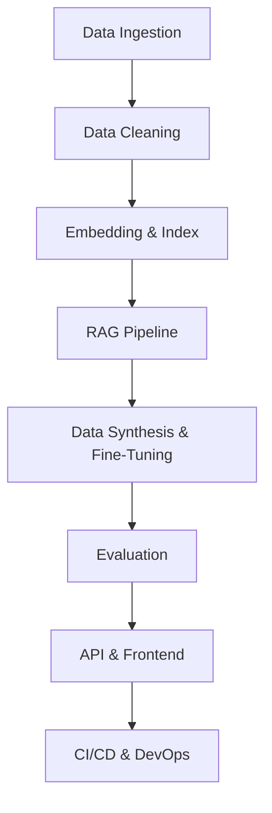

# System Architecture

This document describes the high‑level architecture of the Retrieval‑Augmented Generation (RAG) pipeline.  The pipeline is designed to ingest data from multiple sources, clean and normalise it, embed and index the content, retrieve relevant context at query time, generate answers with citations, synthesise training data, fine‑tune a language model using LoRA/QLoRA, evaluate the system, and deploy an API and minimal front‑end.

## Components

### Data Ingestion

`data_ingestion/` contains connectors for various source types (PDF, web, API and CSV).  The top‑level script `ingest.py` coordinates the ingestion process and writes raw files into `data/raw/`.

### Data Cleaning

`data_cleaning/` holds the logic for de‑duplication, language filtering, HTML stripping, control character removal, and enrichment via Named Entity Recognition (NER) and Semantic Role Labelling (SRL).  The configuration of cleaning rules is specified in `ruleset.yaml`.

### Embedding & Index

`embedding_service/` defines how documents are chunked and embedded.  By default it uses OpenAI’s `text‑embedding‑3‑large` model with 800‑token chunks and 120‑token overlap.  A fallback to HuggingFace models is provided.  Index adapters under `vector_store/` allow switching between FAISS, Chroma and Pinecone.

### RAG Pipeline

`rag_pipeline/` implements retrieval, reranking and generation.  The retrieval layer reads from the vector store to obtain top‑k chunks.  An optional reranker combines cosine similarity with recency bias.  The generation module synthesises an answer using a language model and returns citations for each retrieved context.

### Training

`training/` contains scripts for generating synthetic Question–Context–Answer triples and performing parameter‑efficient fine‑tuning (LoRA/QLoRA).  The training metadata and produced adapters are stored in `artifacts/models/`.

### Evaluation

`evaluation/` provides tools for measuring retrieval precision, context relevance, hallucination rate and other metrics.  Hard thresholds for these metrics are enforced by the Coordinator before deployment.

### API & Frontend

`api/` exposes a FastAPI endpoint that accepts queries, retrieves relevant contexts, generates answers and returns JSON responses with citations and confidence scores.  A minimal React console is provided under `frontend/`.

### DevOps & CI/CD

CI workflows under `.github/workflows/` lint, test and build the project.  A nightly re‑index job ensures that embeddings remain fresh.  Deployment recipes for containerising the service and pushing to a cloud host are also included.

## Interfaces

Pydantic models in `api/schemas.py` define the contracts for API requests and responses.  Other internal components use simple dataclasses or dictionaries for data exchange.