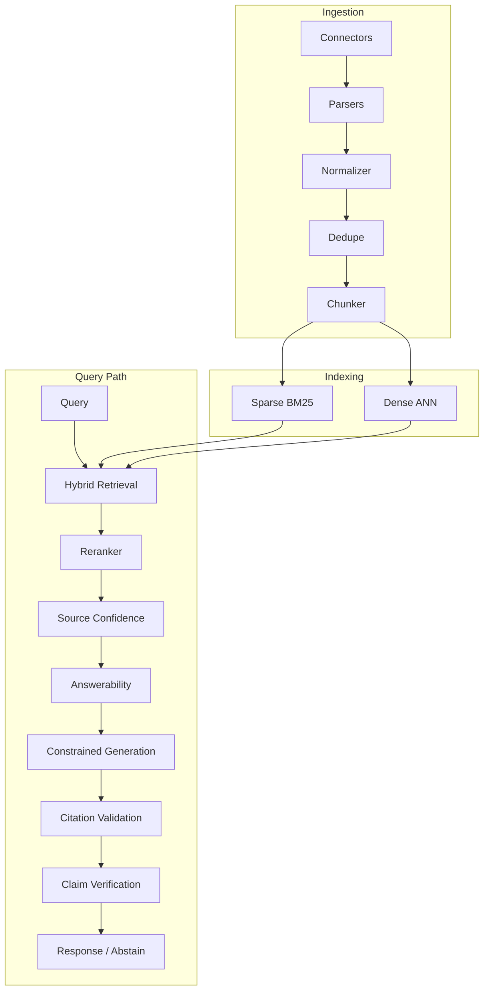

# Production Architecture

## Overview

The RAG system is organized into independent modules under `rag_project/`:

## Near-zero hallucination strategy

We do not guarantee mathematical zero hallucination. Instead:

- Grounded generation with citation IDs
- Answerability gate before generation
- Source confidence thresholds
- Citation and claim verification
- Abstention when evidence is weak

## Local vs production

| Component | Local | Production |
|-----------|-------|------------|
| Metadata | SQLite | Postgres |
| Object store | Filesystem | S3/GCS |
| Sparse index | Local BM25 | OpenSearch |
| Dense index | FAISS Flat/HNSW | Qdrant/Milvus/Pinecone |
| Cache | Memory | Redis |
| Auth | none/api_key | JWT + API keys |

See [scaling_10m_docs.md](./scaling_10m_docs.md) and [hallucination_controls.md](./hallucination_controls.md).
